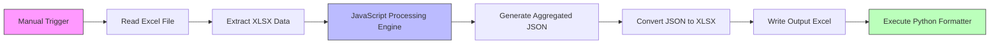
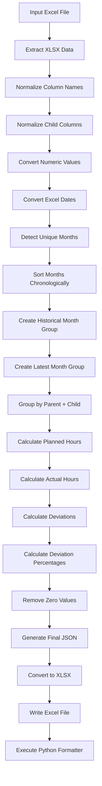
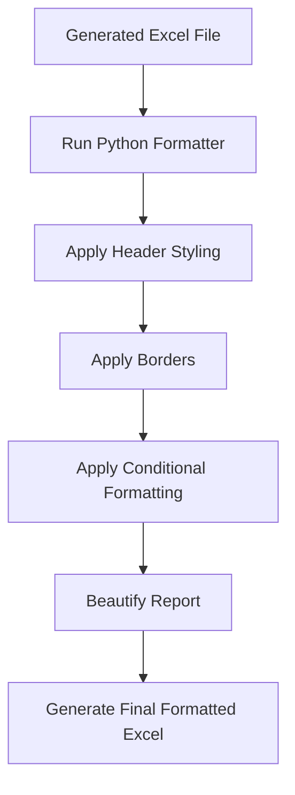

# Excel Formatting & Deviation Analysis Workflow

## Overview
This n8n workflow automates:
- Parent-child effort aggregation
- Monthly effort grouping
- Planned vs Actual comparison
- Deviation analysis
- Dynamic month handling
- Excel report generation
- Python-based Excel formatting

The workflow processes Excel data and generates a professionally formatted deviation analysis report.

---

# Main Workflow Architecture



---

# Workflow Nodes

## 1. Manual Trigger
### Node
`When clicking 'Execute workflow'`

### Purpose
Starts workflow execution manually from n8n.

---

## 2. Read Excel File
### Node
`Read/Write Files from Disk`

### Purpose
Reads source Excel file from disk.

### Input File
```plaintext
C:/Users/Shreya gavli/Desktop/Parent child Exp.xlsx
```

---

## 3. Extract XLSX Data
### Node
`Extract from File`

### Purpose
Extracts Excel sheet data into JSON format.

---

## 4. JavaScript Processing Engine
### Node
`Code in JavaScript`

### Purpose
Implements the complete business logic.

The node performs:
- Column normalization
- Date conversion
- Month grouping
- Planned vs Actual aggregation
- Deviation calculations
- Data cleanup
- Dynamic report generation

---

# Complete Processing Flow



---

# Core Processing Logic

## Step 1 — Input Validation

The workflow checks:
- Empty items
- Missing records

### Error Response
```json
{
  "error": "No input rows received"
}
```

---

# Data Normalization

## Column Normalization

The workflow standardizes columns.

### Supported Variants

| Raw Column | Normalized Column |
|---|---|
| Child | Child1 |
| Child_1 | Child1 |
| Child_2 | Child2 |

---

# Numeric Conversion

The workflow converts:

```plaintext
ExpendHrs → Number
WorkHrs → Number
```

Invalid values become:
```plaintext
0
```

---

# Excel Date Conversion

## Excel Serial Date Handling

Excel serial dates are converted into:

```plaintext
MMMYY
```

### Example
```plaintext
Apr25
May25
Jun25
```

---

# Dynamic Month Grouping

## Unique Month Detection

The workflow:
1. Extracts all unique months
2. Sorts them chronologically
3. Splits them into:
   - Historical Group
   - Latest Month

---

# Month Group Example

```plaintext
Historical Group → Jan25-Mar25
Latest Month → Apr25
```

---

# Grouping Logic

## Group Key

The workflow groups records using:

```plaintext
Parent + Child Combination
```

### Example
```plaintext
Infrastructure | API
Development | Backend
```

---

# Planned vs Actual Logic

## Planned Hours

```math
PlannedHours = \sum ExpendHrs
```

---

## Actual Hours

```math
ActualHours = \sum WorkHrs
```

---

# Deviation Calculations

## Deviation Formula

```math
Deviation = Actual - Planned
```

---

## Deviation Percentage Formula

```math
Deviation\% = \frac{(Actual - Planned)}{Planned} \times 100
```

---

# Special Deviation Handling

## When Planned = 0

| Scenario | Result |
|---|---|
| Actual = 0 | 0% |
| Actual > 0 | 100% |

---

# Aggregation Structure

The workflow generates:

| Field Type | Example |
|---|---|
| Planned Hours | Planned_Apr25 |
| Actual Hours | Actual_Apr25 |
| Deviation | Dev_Apr25 |
| Deviation % | Dev%_Apr25 |
| Totals | Planned_Total |

---

# Total Calculations

## Planned Total

```math
PlannedTotal = Group1Planned + Group2Planned
```

---

## Actual Total

```math
ActualTotal = Group1Actual + Group2Actual
```

---

## Total Deviation

```math
DevTotal = ActualTotal - PlannedTotal
```

---

# Deviation % Total Logic

The workflow combines:
- Historical deviation %
- Latest month deviation %

into:

```plaintext
Dev%_Total
```

---

# Data Cleanup Logic

## Zero Removal

All numeric zero values are converted to blank strings.

### Example
```plaintext
0 → ""
```

---

# Empty Row Removal

Rows are skipped if:

```plaintext
Planned_Total = blank
AND
Actual_Total = blank
```

---

# Final Cleanup

The workflow performs:
- Global zero removal
- Final data sanitization
- Empty value cleanup

---

# Output Structure

Generated report columns:

| Column | Description |
|---|---|
| Parent | Parent category |
| Child1 | Child hierarchy |
| Child2 | Child hierarchy |
| Child3 | Child hierarchy |
| Planned_* | Planned hours |
| Actual_* | Actual hours |
| Dev_* | Deviation |
| Dev%_* | Percentage deviation |

---

# Excel Conversion Flow

## Convert JSON → XLSX
### Node
`Convert to File1`

### Purpose
Converts processed JSON into Excel format.

---

# File Output Layer

## Write Excel File
### Node
`Read/Write Files from Disk2`

### Output File
```plaintext
C:/n8n_scripts/input_full.xlsx
```

---

# Python Formatting Layer

## Execute Command
### Node
`Execute Command`

### Command
```bash
python "C:/n8n_scripts/excel_formatter_full.py" "C:/n8n_scripts/input_full.xlsx"
```

---

# Python Formatter Responsibilities

The Python script likely performs:
- Excel beautification
- Header styling
- Conditional formatting
- Borders
- Alignment
- Cell formatting
- Font styling

---

# Python Formatting Flow



---

# Key Features

## Dynamic Month Handling
Automatically:
- Detects months
- Groups historical periods
- Identifies latest month

Without hardcoding.

---

## Smart Aggregation
Supports:
- Parent-child grouping
- Multi-level hierarchy
- Dynamic reporting

---

## Automated Deviation Analysis
Calculates:
- Planned effort
- Actual effort
- Variance
- Percentage deviation

---

## Automatic Cleanup
Removes:
- Empty rows
- Zero values
- Invalid entries

---

## Excel Beautification
Uses Python automation for:
- Styling
- Formatting
- Visual presentation

---

# Technologies Used

| Technology | Purpose |
|---|---|
| n8n | Workflow orchestration |
| JavaScript | Data transformation |
| Python | Excel formatting |
| XLSX Processing | File handling |

---

# Workflow Components

## Input File
```plaintext
Parent child Exp.xlsx
```

---

## Intermediate File
```plaintext
input_full.xlsx
```

---

## Python Script
```plaintext
excel_formatter_full.py
```

---

# Expected Final Outputs

The workflow produces:

## 1. Aggregated Effort Report
Contains:
- Parent-child grouping
- Historical effort analysis
- Monthly effort comparison

---

## 2. Deviation Analysis Report
Includes:
- Planned vs Actual comparison
- Variance analysis
- Percentage deviation tracking

---

## 3. Formatted Excel Report
Professionally styled report with:
- Formatting
- Highlighting
- Clean structure
- Excel beautification

---

## 4. Dynamic Monthly Reporting
Automatically adapts to:
- New months
- Additional data
- Changing Excel structures
