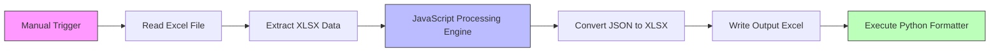
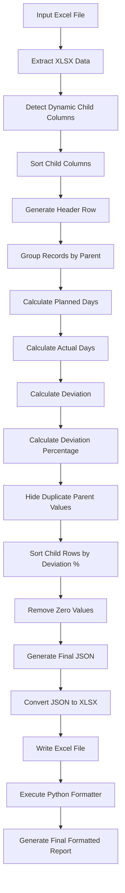
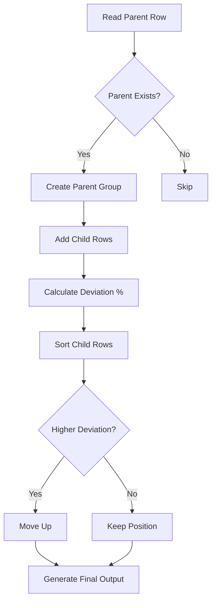

# Excel Parent-Child Grouping Workflow

## Overview
This n8n workflow automates the grouping, sorting, deviation calculation, and formatting of Parent-Child Excel data.

The workflow:
- Reads Excel input data
- Extracts XLSX records
- Dynamically detects child columns
- Groups records by Parent
- Calculates planned vs actual deviations
- Sorts child rows based on deviation percentage
- Generates a formatted Excel report
- Executes a Python formatter script

---

# Main Workflow Architecture



---

# Workflow Nodes

## 1. Manual Trigger
### Node
`When clicking 'Execute workflow'`

### Purpose
Starts the workflow manually from n8n UI.

---

## 2. Read Excel File
### Node
`Read/Write Files from Disk`

### Purpose
Reads the Excel source file.

### Input File
```plaintext
C:/Users/Shreya gavli/Documents/goa_online.xlsx
```

---

## 3. Extract XLSX Data
### Node
`Extract from File`

### Purpose
Extracts Excel sheet data into JSON format.

---

## 4. JavaScript Processing Engine

### Purpose
Core workflow logic implementation.

The JavaScript node performs:
- Dynamic child column detection
- Header row generation
- Grouping by Parent
- Planned vs Actual calculations
- Deviation calculations
- Child row sorting
- Data cleanup

---

# Processing Algorithm

## Step 1 — Detect Dynamic Child Columns

The workflow automatically identifies all columns starting with:

```plaintext
Child1
Child2
Child3
...
```

This enables support for:
- Variable child hierarchy depth
- Dynamic Excel structures

---

## Step 2 — Sort Child Columns

Child columns are sorted numerically:

Example:
```plaintext
Child1
Child2
Child3
```

---

## Step 3 — Generate Header Row

A custom report header row is generated dynamically.

Generated columns:
- SrNo
- Parent
- PM
- Dynamic Child Columns
- Planned Days
- Actual Days
- Deviation Days
- Total Deviation %

---

## Step 4 — Group Records by Parent

The workflow creates groups using:

```plaintext
Parent Name
```

Each parent contains:
- Parent row
- Child rows

Parent order is preserved from original Excel input.

---

# Calculation Logic

## Planned Days
```plaintext
Planned days
```

## Actual Days
```plaintext
Work days
```

---

# Deviation Formula

## Deviation Days

```math
Deviation = Actual - Planned
```

---

## Deviation Percentage

```math
Deviation\% = \frac{(Actual - Planned)}{Planned} \times 100
```

Special handling:
- Planned = 0 and Actual = 0 → blank
- Planned = 0 and Actual > 0 → Actual value used

---

# Parent Row Handling

The workflow:
- Displays Parent name only once
- Hides repeated Parent values in child rows

Example:

| Parent | Child |
|---|---|
| Development | Backend |
|  | API |
|  | Database |

---

# Child Row Sorting

Child rows are sorted by:

```plaintext
Total Deviation %
```

### Sorting Order
Descending order:
- Highest deviation first
- Lowest deviation last

Blank values are pushed to bottom.

---

# Cleanup Logic

## Zero Removal

Numeric zero values are replaced with blank strings.

Example:
```plaintext
0 → ""
```

---

## Unicode Cleanup

The workflow normalizes Unicode minus signs:

```plaintext
− → -
```

This prevents Excel parsing issues.

---

# Detailed Workflow Flowchart



---

# Grouping and Sorting Logic Diagram



---

# Output Structure

Generated report columns:

| Column | Description |
|---|---|
| SrNo | Serial Number |
| Parent | Parent Category |
| PM | Project Manager |
| Child1 | Child Hierarchy |
| Planned Days | Estimated effort |
| Actual Days | Actual effort |
| Deviation Days | Difference |
| Total Deviation % | Percentage variance |

---

# Output Generation

## Convert JSON → XLSX
### Node
`Convert to File1`

Converts transformed JSON into Excel format.

---

## Write Excel File
### Node
`Read/Write Files from Disk2`

### Output File
```plaintext
C:/n8n_scripts/input.xlsx
```

---

# Python Formatting Layer

## Execute Command
```bash
python "C:/n8n_scripts/excel_formatter.py" "C:/n8n_scripts/input.xlsx"
```

---

# Python Formatter Responsibilities

The Python script likely performs:
- Excel beautification
- Header styling
- Cell formatting
- Conditional formatting
- Borders and alignment
- Font styling
- Report presentation formatting

---

# Key Features

## Dynamic Column Detection
Automatically handles:
- Child1
- Child2
- Child3
- Additional child levels

Without hardcoding.

---

## Intelligent Parent Grouping
Maintains:
- Parent hierarchy
- Original parent order
- Structured child organization

---

## Automated Deviation Analysis
Calculates:
- Planned effort
- Actual effort
- Variance
- Percentage deviation

---

## Smart Sorting
Highlights:
- Highest deviation child rows first
- Easier risk identification

---

# Technologies Used

| Technology | Purpose |
|---|---|
| n8n | Workflow automation |
| JavaScript | Data transformation |
| Python | Excel formatting |
| XLSX Processing | File handling |

---

# File Dependencies

## Input File
```plaintext
goa_online.xlsx
```

## Intermediate File
```plaintext
input.xlsx
```

## Python Script
```plaintext
excel_formatter.py
```

---

# Expected Output

A professionally formatted Excel report containing:
- Parent-child grouped data
- Deviation analysis
- Dynamic hierarchy handling
- Sorted variance reporting
- Clean Excel presentation
