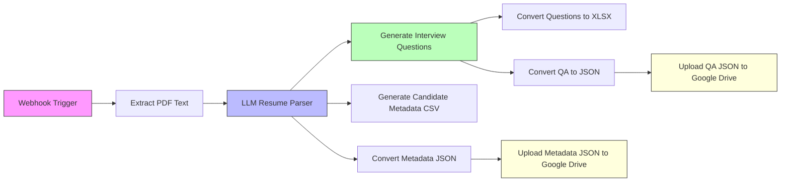
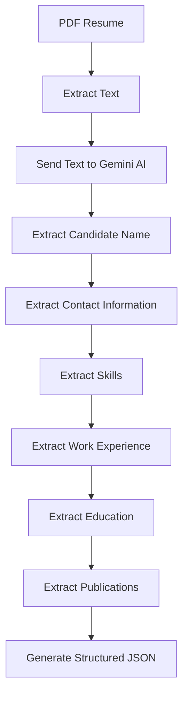
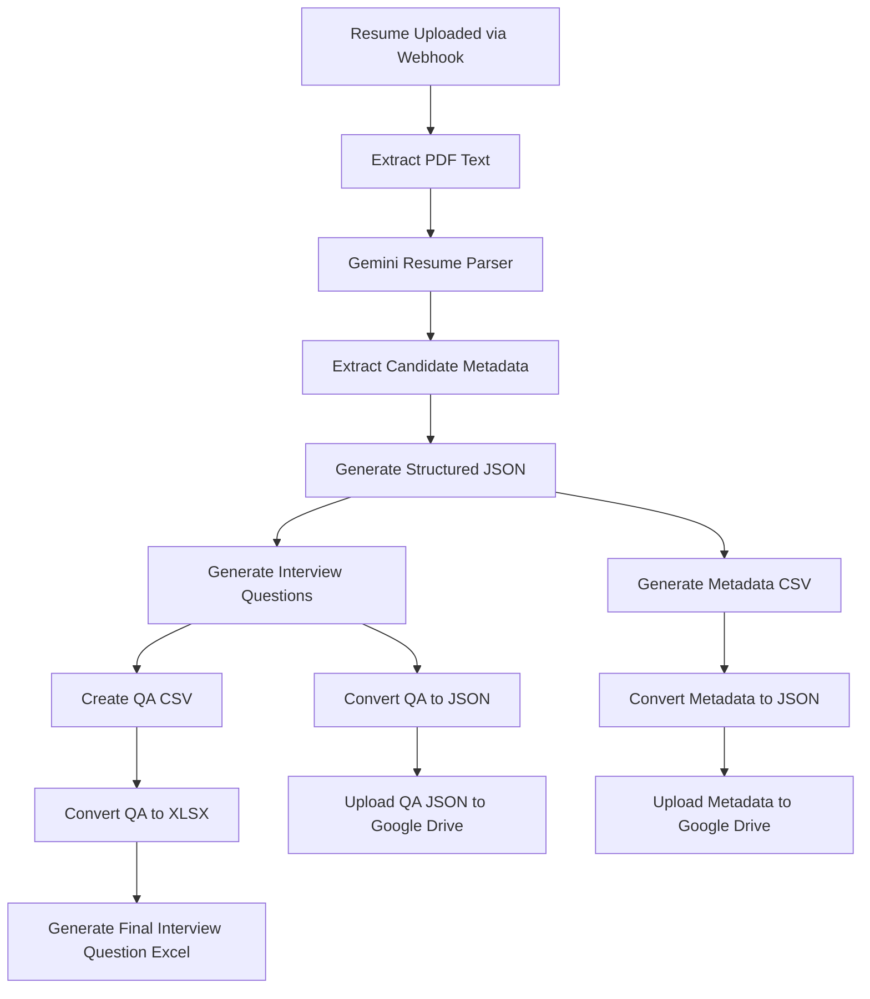
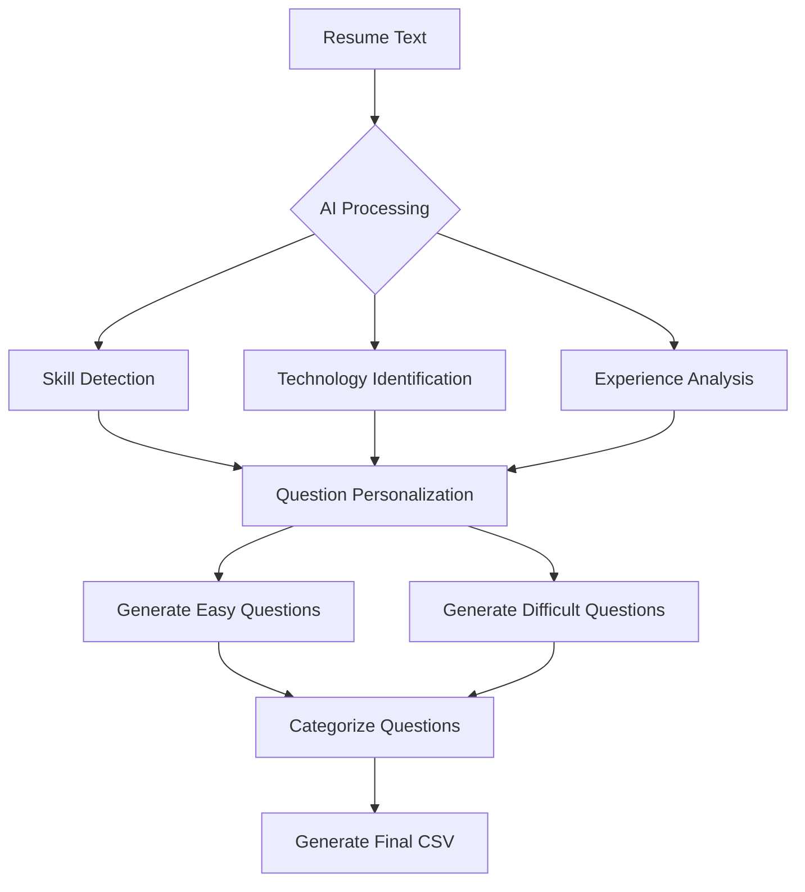

# Resume Parser & Interview Question Generator Workflow

## Overview
This n8n workflow automates:
- Resume extraction from PDF
- Candidate metadata parsing
- AI-powered interview question generation
- CSV/JSON conversion
- Google Drive uploads

The workflow uses Google Gemini AI models to:
1. Extract structured candidate information
2. Generate interview questions
3. Create candidate metadata reports
4. Upload outputs to Google Drive

---

# Main Workflow Architecture



---

# Workflow Nodes

## 1. Webhook Trigger
### Node
`Webhook`

### Purpose
Receives uploaded resume files through HTTP POST requests.

### Configuration
```plaintext
Method: POST
Response Mode: Last Node
```

---

## 2. Extract Resume Text
### Node
`Extract from File`

### Purpose
Extracts text content from uploaded PDF resumes.

### Supported Input
```plaintext
PDF Resume Files
```

---

## 3. Resume Parsing Engine
### Node
`Basic LLM Chain`

### AI Model
Google Gemini Chat Model

### Purpose
Extracts structured candidate metadata from resume text.

---

# Resume Parsing Output Structure

The workflow extracts:

```json
{
  "Full Name": "",
  "Location": "",
  "Email": "",
  "Phone": "",
  "LinkedIn": "",
  "Skills": [],
  "Work Experience": [],
  "Education": [],
  "Publications / Patents": []
}
```

---

# AI Resume Parsing Flow



---

# Interview Question Generator

## Node
`Message a model`

### AI Model
```plaintext
Gemini 2.5 Flash
```

### Purpose
Generates personalized interview questions based on:
- Candidate skills
- Experience
- Technologies
- Resume background

---

# Question Generation Rules

The workflow generates:
- 15 interview questions total
- 5 questions per category

### Categories
| Category | Questions |
|---|---|
| Generic Questions | 5 |
| Technology Questions | 5 |
| Coding Exercise | 5 |

---

# Difficulty Distribution

Each category contains:
- 3 Easy questions
- 2 Difficult questions

---

# Question Output Structure

```csv
Category,Difficulty,Question,Answer
```

Example:

```csv
Technology Questions,easy,"What is REST API?","REST API is..."
```

---

# Candidate Metadata CSV Generator

## Node
`Message a model1`

### Purpose
Converts extracted candidate metadata into CSV format.

---

# Metadata CSV Format

Generated fields:

| Field |
|---|
| Name |
| Email |
| Phone |
| Location |
| LinkedIn |
| Skills |
| Education |
| WorkExperience |
| Publications |

---

# Data Conversion Layer

## Convert Metadata to JSON
### Node
`Convert to File2`

Converts parsed metadata into JSON format.

---

## Convert Questions to XLSX
### Node
`Convert to File`

Converts generated interview questions into Excel format.

---

## Convert QA to JSON
### Node
`Convert to File3`

Converts generated QA data into JSON format.

---

# Google Drive Upload Flow

## Upload Candidate Metadata
### Node
`Upload file`

### Output File
```plaintext
candidatemetadata.json
```

---

## Upload QA Output
### Node
`Upload file1`

### Output File
```plaintext
qa_output.json
```

---

# Complete Workflow Processing Flow



---

# AI Logic Flow



---

# Core Features

## AI Resume Parsing
Automatically extracts:
- Personal information
- Skills
- Education
- Experience
- Publications

---

## Personalized Interview Questions
Questions are dynamically generated based on:
- Candidate technologies
- Experience level
- Resume content

---

## Structured Output Generation
Supports:
- JSON output
- CSV output
- XLSX output

---

## Automated Cloud Storage
Uploads generated outputs directly to:
```plaintext
Google Drive
```

---

# Technologies Used

| Technology | Purpose |
|---|---|
| n8n | Workflow orchestration |
| Google Gemini AI | Resume parsing & QA generation |
| PDF Extraction | Resume text extraction |
| CSV/XLSX Conversion | Report generation |
| Google Drive API | Cloud storage |

---

# Workflow Components

## Input
```plaintext
PDF Resume
```

---

## AI Models Used

| Model | Purpose |
|---|---|
| Gemini Chat Model | Resume parsing |
| Gemini 2.5 Flash | Question generation |

---

# Generated Outputs

## Candidate Metadata
```plaintext
candidatemetadata.json
```

---

## QA Output
```plaintext
qa_output.json
```

---

## Interview Question Excel
```plaintext
questions.xlsx
```

---

# Expected Final Outputs

The workflow produces:

### 1. Structured Candidate Metadata
Contains:
- Skills
- Experience
- Education
- Contact information

---

### 2. AI-Generated Interview Questions
Includes:
- Generic questions
- Technology questions
- Coding exercises
- Sample answers

---

### 3. Excel Reports
Formatted interview question sheets for interviewers.

---

# Key Benefits

## Automated Resume Screening
Reduces manual HR effort.

---

## AI-Powered Question Personalization
Creates role-specific interview questions automatically.

---

## Multi-Format Output Support
Supports:
- JSON
- CSV
- XLSX

---

## Cloud-Based Storage
Automatically archives outputs to Google Drive.
