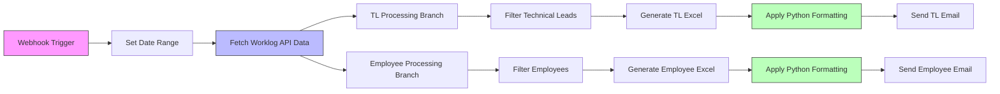
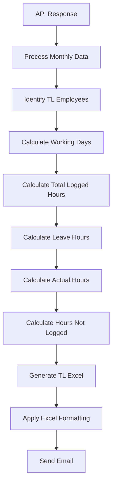
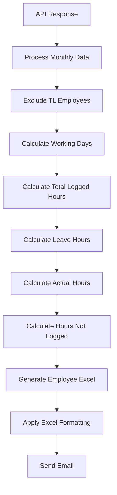
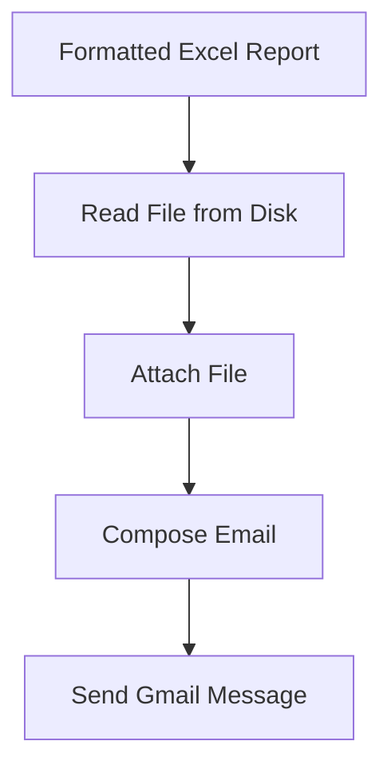
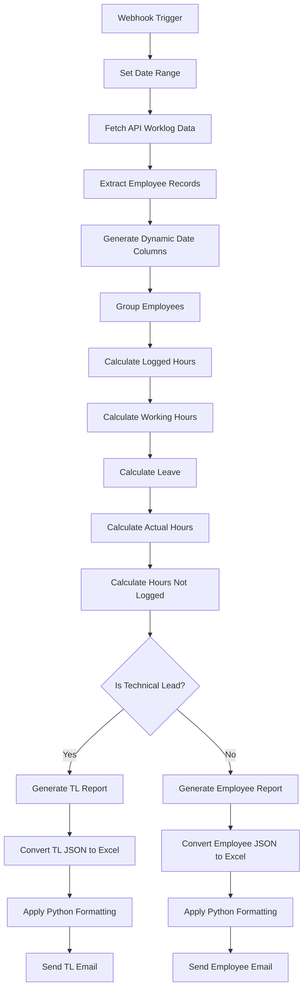

# Monthly Worklog Automation Workflow

## Overview
This n8n workflow automates the complete monthly worklog reporting process for:
- Technical Leads (TLs)
- Non-TL Employees

The workflow:
- Fetches worklog data from API
- Processes employee work hours
- Calculates leave and missing hours
- Generates formatted Excel reports
- Applies Python-based Excel styling
- Sends automated email reports

---

# Main Workflow Architecture



---

# Workflow Nodes

## 1. Webhook Trigger
### Node
`Webhook1`

### Purpose
Triggers the workflow through an API endpoint.

---

## 2. Set Date Range
### Node
`Edit Fields1`

### Purpose
Defines monthly reporting date range.

### Example
```json
{
  "FromDate": "01-Mar-2026",
  "ToDate": "31-Mar-2026"
}
```

---

## 3. Fetch Worklog Data
### Node
`HTTP Request1`

### Purpose
Retrieves worklog data from external API.

### API Endpoint
```plaintext
https://upaygoa.com/JiraAPILIVE/API/FetchData/GetReportData
```

---

# API Parameters

| Parameter | Value |
|---|---|
| ReportId | 0 |
| SubReportId | 19 |
| ProjId | 0 |
| UserKey | U2755 |

---

# Processing Branches

The workflow splits into:
1. TL Monthly Worklog Branch
2. Employee Monthly Worklog Branch

---

# Technical Lead Processing Flow



---

# Employee Processing Flow



---

# Core Business Logic

## Employee Grouping

The workflow groups records using:

```plaintext
EmployeeName + Designation
```

---

# Dynamic Date Generation

## Daily Columns

Each unique worklog date becomes a separate report column.

### Example
```plaintext
01/03/2026
02/03/2026
03/03/2026
```

---

# Technical Lead Logic

The workflow contains a predefined list of Technical Leads.

### TL Weekend Rules
Technical Leads receive:
- Saturday Off
- Sunday Off

---

## Non-TL Weekend Rules

Employees receive:
- Sunday Off only

---

# Holiday Handling

Predefined holidays are excluded from working day calculations.

### Example Holidays
```plaintext
2025-10-02
2025-10-20
```

---

# Worklog Calculation Logic

## Total Logged Hours

```math
TotalLogged = \sum DailyLoggedHours
```

---

## Working Hours Formula

```math
WorkingHours = WorkingDays \times 7
```

---

# Leave Calculation

The workflow checks:

```plaintext
LeaveTakenYn
```

Accepted leave indicators:
- 1
- true
- y
- yes

---

# Leave Hours Formula

```math
LeaveHours = LeaveDays \times 8
```

---

# Actual Hours Formula

```math
ActualHours = WorkingHours - LeaveHours
```

---

# Hours Not Logged Formula

```math
HoursNotLogged = ActualHours - TotalLogged
```

---

# Days Not Logged Formula

```math
DaysNotLogged = \frac{HoursNotLogged}{8}
```

Rounded to nearest integer.

---

# Unicode & Data Cleanup

The workflow:
- Removes hidden characters
- Cleans invalid keys
- Normalizes employee names

---

# Employee Report Structure

Generated report fields:

| Field | Description |
|---|---|
| EmployeeName | Employee name |
| Designation | Employee role |
| Daily Columns | Logged daily hours |
| Total Logged | Total logged hours |
| Working Hours | Expected hours |
| Leave | Leave count |
| Leave Hours | Leave deduction |
| Actual Hours | Expected working hours |
| Hours Not Logged | Missing hours |
| Days Not Logged | Missing work days |

---

# Excel Generation Flow

## Convert JSON to XLSX
### Nodes
- `Convert to File6`
- `Convert to File7`

### Purpose
Converts processed JSON into Excel files.

---

# Python Excel Formatting

## Formatter Script
```plaintext
color_excel.py
```

### Responsibilities
- Header coloring
- Conditional formatting
- Borders
- Cell styling
- Excel beautification

---

# Generated Report Paths

## TL Report
```plaintext
C:/Users/Shreya gavli/Desktop/worklog/Tl_monthly/formatted_worklog.xlsx
```

---

## Employee Report
```plaintext
C:/Users/Shreya gavli/Desktop/worklog/Employee_monthly/formatted_worklog_emp.xlsx
```

---

# Email Automation

## TL Report Email

### Subject
```plaintext
TL monthly worklog
```

---

## Employee Report Email

### Subject
```plaintext
Employee monthly worklog
```

---

# Gmail Delivery Flow



---

# Complete End-to-End Workflow



---

# Key Features

## Automated Monthly Reporting
Generates:
- TL reports
- Employee reports

Automatically.

---

## Smart Worklog Analysis
Calculates:
- Logged hours
- Leave hours
- Missing hours
- Missing work days

---

## Dynamic Date Handling
Automatically creates:
- Daily worklog columns
- Monthly structures

---

## Intelligent Employee Classification
Separates:
- Technical Leads
- Employees

Using predefined logic.

---

## Excel Beautification
Automatically applies:
- Formatting
- Styling
- Highlighting
- Conditional colors

Using Python automation.

---

# Technologies Used

| Technology | Purpose |
|---|---|
| n8n | Workflow orchestration |
| JavaScript | Data transformation |
| Python | Excel formatting |
| Gmail API | Automated email delivery |
| HTTP API | Worklog data retrieval |
| XLSX Conversion | Excel generation |

---

# Workflow Components

## Input
```plaintext
Worklog API Data
```

---

## Processing
```plaintext
JavaScript Logic
```

---

## Formatting
```plaintext
Python Excel Formatter
```

---

## Delivery
```plaintext
Gmail Automation
```

---

# Expected Final Outputs

The workflow produces:

## 1. Technical Lead Monthly Report
Contains:
- Daily logged hours
- Leave calculations
- Missing work hours
- Missing work days

---

## 2. Employee Monthly Report
Contains:
- Worklog summaries
- Leave tracking
- Actual working hours
- Productivity analysis

---

## 3. Formatted Excel Files
Professionally formatted reports with:
- Color coding
- Highlighting
- Structured layouts

---

## 4. Automated Email Reports
Monthly reports automatically emailed with Excel attachments.
