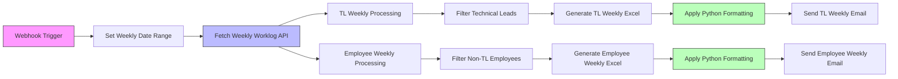
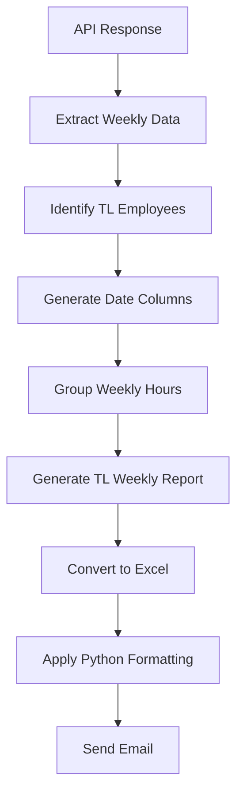
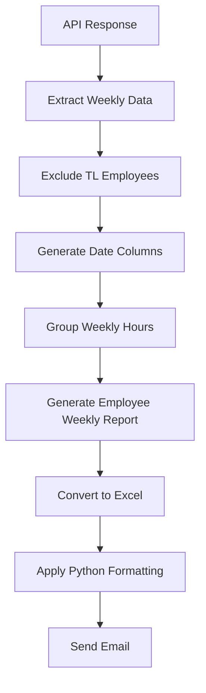
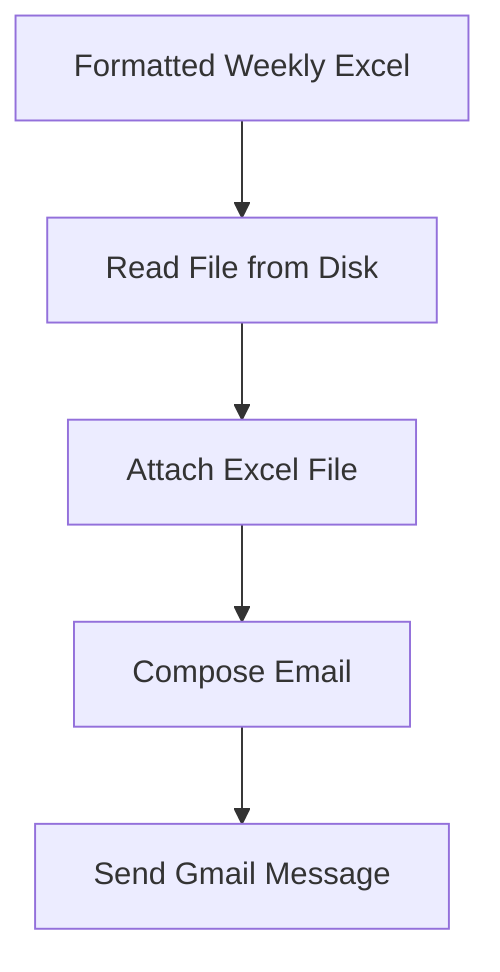
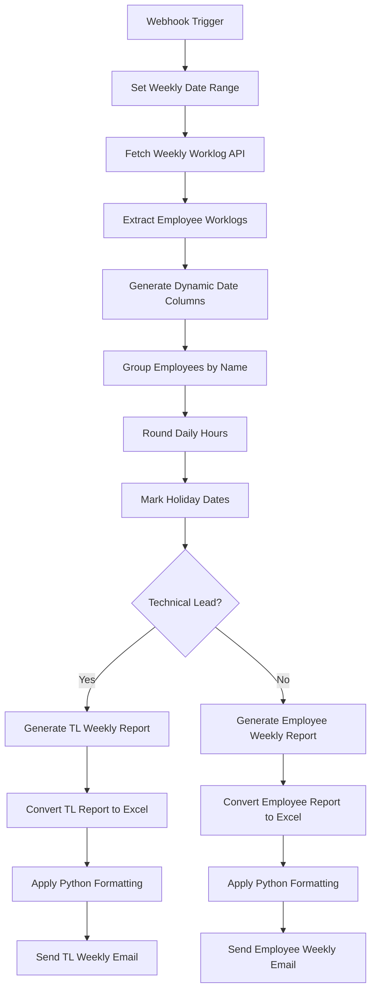

# Weekly Worklog Automation Workflow

## Overview
This n8n workflow automates weekly worklog reporting for:
- Technical Leads (TLs)
- Non-TL Employees

The workflow:
- Fetches weekly worklog data from API
- Processes employee daily hours
- Generates weekly Excel reports
- Applies automated Excel formatting
- Sends reports via Gmail

Separate reports are generated for:
- TL Weekly Worklogs
- Employee Weekly Worklogs

---

# Main Workflow Architecture



---

# Workflow Nodes

## 1. Webhook Trigger
### Node
`Webhook`

### Purpose
Starts workflow execution through API trigger.

---

## 2. Set Weekly Date Range
### Node
`Edit Fields`

### Purpose
Defines weekly reporting range.

### Example
```json
{
  "FromDate": "1-Mar-2026",
  "ToDate": "31-Mar-2026"
}
```

---

## 3. Fetch Worklog Data
### Node
`HTTP Request`

### Purpose
Fetches employee worklog data from external API.

### API Endpoint
```plaintext
https://upaygoa.com/JiraAPILIVE/API/FetchData/GetReportData
```

---

# API Parameters

| Parameter | Value |
|---|---|
| ReportId | 0 |
| SubReportId | 19 |
| ProjId | 0 |
| UserKey | U2755 |

---

# Workflow Branching

The workflow splits into:
1. Technical Lead Weekly Reports
2. Employee Weekly Reports

---

# Weekly TL Processing Flow



---

# Weekly Employee Processing Flow



---

# Core Processing Logic

## Step 1 — Extract API Data

The workflow reads:

```plaintext
Data.Result
```

from API response.

---

# Dynamic Date Handling

## Date Conversion

Dates are converted from:

```plaintext
YYYY-MM-DD
```

to:

```plaintext
D/M/YYYY
```

### Example
```plaintext
2026-03-01 → 1/3/2026
```

---

# Dynamic Weekly Columns

Each unique worklog date becomes a report column.

### Example
```plaintext
1/3/2026
2/3/2026
3/3/2026
```

---

# Employee Grouping Logic

Employees are grouped using:

```plaintext
EmployeeName + Designation
```

---

# Hour Processing Logic

## Daily Hours

The workflow:
- Reads daily logged hours
- Rounds decimal values
- Converts invalid values to 0

---

# Holiday Handling

Predefined holidays are automatically marked.

### Example Holiday
```plaintext
2025-10-02
```

---

# Holiday Logic

For holiday dates:
```plaintext
Daily Hours = 0
```

for all employees.

---

# Technical Lead Filtering

The workflow contains a predefined Technical Lead list.

### Logic
```plaintext
If EmployeeName exists in TL list
→ Include in TL Weekly Report
Else
→ Include in Employee Weekly Report
```

---

# Unicode Cleanup Logic

The workflow:
- Removes hidden BOM characters
- Cleans invalid key names
- Normalizes employee names

---

# Weekly Report Structure

Generated report fields:

| Field | Description |
|---|---|
| EmployeeName | Employee name |
| Designation | Employee role |
| Daily Columns | Daily logged hours |

---

# Excel Conversion Flow

## Convert JSON → XLSX
### Nodes
- `Convert to File6`
- `Convert to File7`

### Purpose
Generates Excel worklog reports.

---

# Python Excel Formatting

## Formatter Script
```plaintext
color_excel.py
```

### Responsibilities
- Cell coloring
- Header formatting
- Borders
- Alignment
- Conditional formatting
- Excel beautification

---

# Output Report Paths

## TL Weekly Report
```plaintext
C:/Users/Shreya gavli/Desktop/worklog/Tl_weekly/formatted_worklog_tl_weekly.xlsx
```

---

## Employee Weekly Report
```plaintext
C:/Users/Shreya gavli/Desktop/worklog/Employee_weekly/formatted_worklog_emp_weekly.xlsx
```

---

# Gmail Email Automation

## TL Weekly Email

### Subject
```plaintext
TL weekly worklog
```

---

## Employee Weekly Email

### Subject
```plaintext
Employee weekly Worklog
```

---

# Gmail Delivery Flow



---

# Complete End-to-End Workflow



---

# Key Features

## Automated Weekly Reporting
Generates:
- TL weekly reports
- Employee weekly reports

Automatically.

---

## Dynamic Date Column Creation
Automatically creates:
- Weekly daily columns
- Dynamic worklog structure

---

## Smart Employee Classification
Separates:
- Technical Leads
- Employees

Using predefined logic.

---

## Automated Holiday Handling
Marks holidays automatically across reports.

---

## Excel Beautification
Applies:
- Colors
- Formatting
- Conditional styling
- Highlighting

Using Python automation.

---

## Email Automation
Automatically emails:
- TL weekly reports
- Employee weekly reports

with Excel attachments.

---

# Technologies Used

| Technology | Purpose |
|---|---|
| n8n | Workflow orchestration |
| JavaScript | Data transformation |
| Python | Excel formatting |
| Gmail API | Email automation |
| HTTP API | Worklog retrieval |
| XLSX Conversion | Excel generation |

---

# Workflow Components

## Input
```plaintext
Weekly Worklog API Data
```

---

## Processing
```plaintext
JavaScript Logic
```

---

## Formatting
```plaintext
Python Excel Formatter
```

---

## Delivery
```plaintext
Gmail Automation
```

---

# Expected Final Outputs

The workflow produces:

## 1. TL Weekly Worklog Report
Contains:
- Daily logged hours
- Weekly summaries
- Formatted Excel report

---

## 2. Employee Weekly Worklog Report
Contains:
- Employee daily worklogs
- Weekly reporting
- Excel formatting

---

## 3. Formatted Excel Files
Professionally formatted reports with:
- Color coding
- Structured layout
- Clean presentation

---

## 4. Automated Weekly Emails
Weekly reports automatically sent with Excel attachments.
